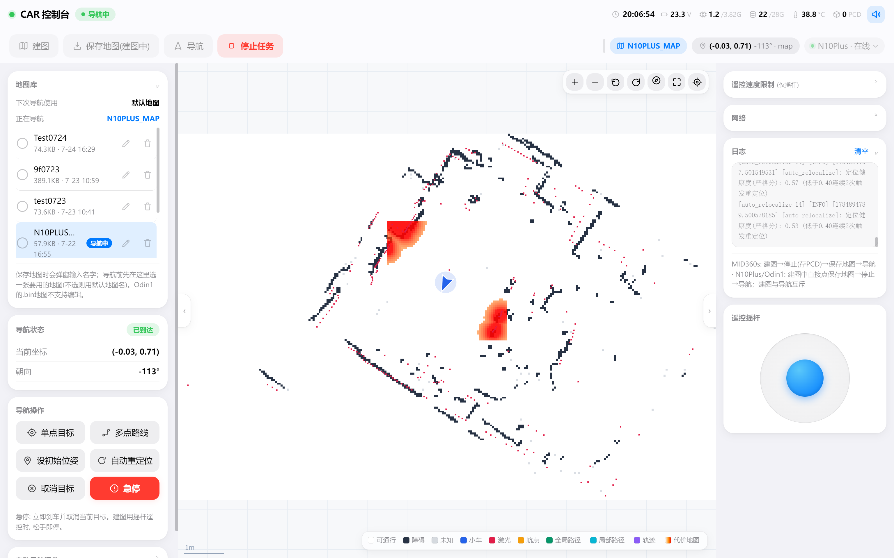
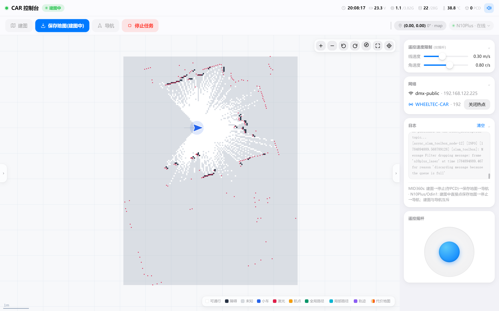
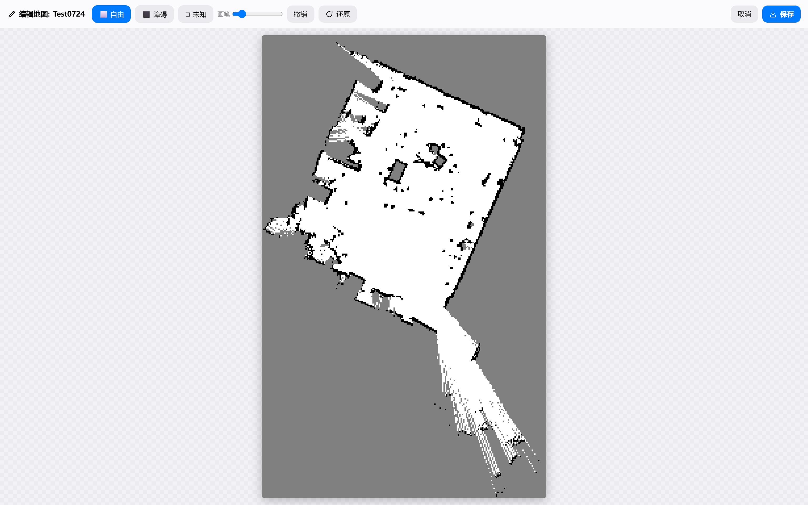
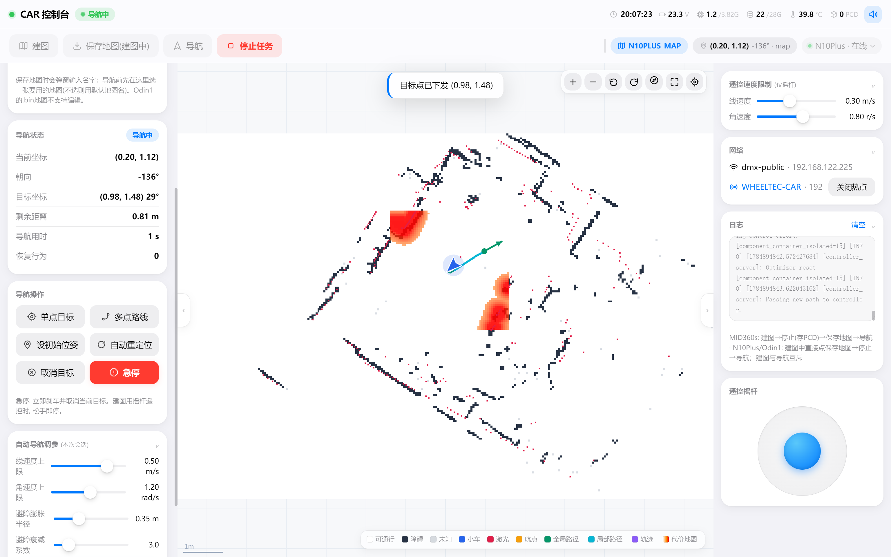
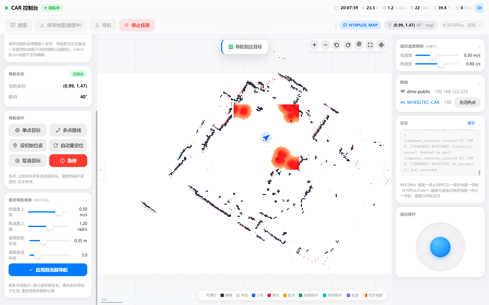
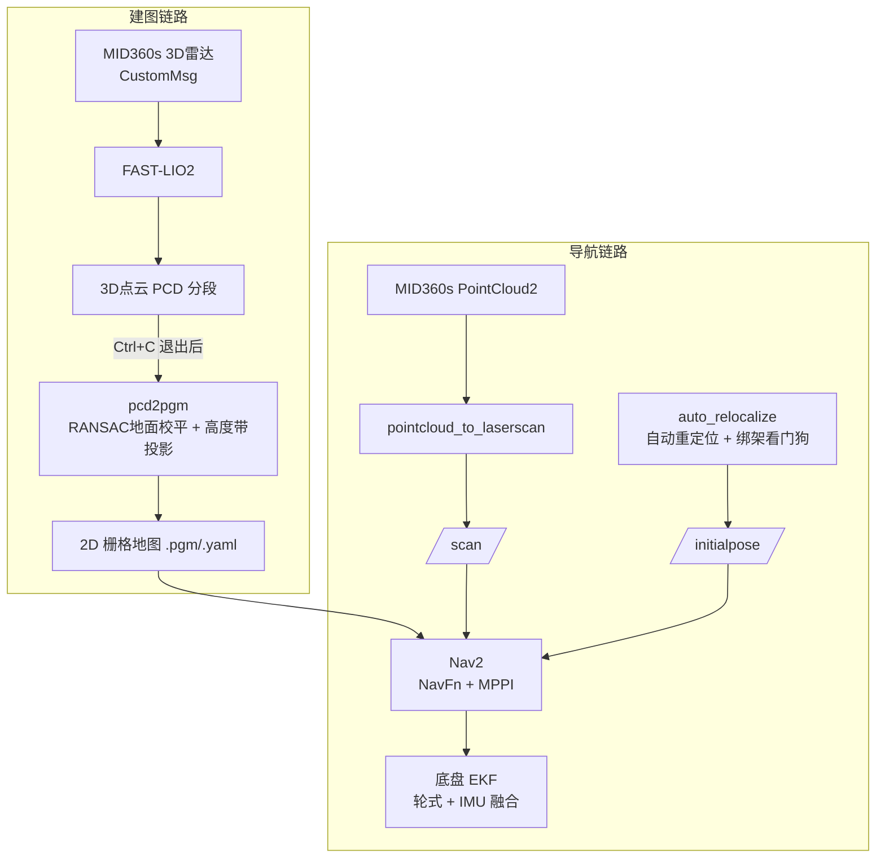

# WHEELTEC 小车 · MID360 / N10Plus 建图导航系统

基于 **Livox MID360s 3D 激光雷达 + FAST-LIO2** 的建图导航方案，配套一个**浏览器 Web 控制台**，
可在手机 / 平板上完成遥控、建图、存图、导航全流程。除 3D 方案外，同时支持 **N10Plus 2D 激光 + slam_toolbox**
和 **Odin1 视觉激光 SLAM 模组**三种传感器模式，一套框架切换使用。

> 已在 **鲁班猫4（LubanCat4 / RK3588S, 4GB 内存）** 无头小车主控上完整跑通。



---

## ✨ 功能特性

- **3D 建图**：MID360s → FAST-LIO2 实时里程计与点云，分段落盘防内存爆掉（4GB 内存友好）。
- **点云转 2D 地图**：自研 `pcd2pgm`，RANSAC **地面校平**（消除安装倾角，避免远处地面被翘成障碍），
  按高度带投影生成 Nav2 可用的 `.pgm/.yaml`。
- **自动重定位 + 绑架检测**：启动自动重定位，运行中看门狗监测；采用**双 σ 似然场**
  （宽 σ 全局搜索、窄 σ 健康检查）区分"蒙对"与真正定位成功。
- **Nav2 导航**：NavFn 规划 + MPPI 控制，针对差速小车做了防扭摆等 5 项参数修复。
- **Web 控制台**（`wheeltec_webapp`）：纯浏览器端轻量 RViz，
  实时显示地图 / 激光 / 全局+局部路径 / 轨迹 / 代价地图（图例可点击切换图层），
  支持摇杆遥控、点图下发目标 / 多点巡航、地图库管理、后端预生成的语音播报、双网卡热点管理等。
- **多传感器模式**：MID360s(3D) · N10Plus(2D) · Odin1，三种模式互斥切换，共用同一套底盘与重定位逻辑。

---

## 🖼️ 界面 / 效果展示

> Web 控制台实拍（当前为 N10Plus 2D 模式）；MID360 3D 点云建图与硬件照片待后续补充。

| 建图运行页面 | 地图编辑 |
|---|---|
|  |  |

| 导航中（全局+局部路径） | 导航已到达 |
|---|---|
|  |  |

---

## 🧭 系统架构



- FAST-LIO 的 TF 树（`camera_init→body`）与底盘 TF 树相互独立，建图时 RViz Fixed Frame 用 `camera_init`，导航时用 `map`。
- 建图与导航**不能同时运行**（雷达数据格式不同）。

---

## 📦 包说明

| 包 | 类型 | 职责 |
|----|------|------|
| `wheeltec_fastlio` | **原创** | 核心集成：pcd2pgm(点云→2D地图，含地面校平)、auto_relocalize(扫描匹配重定位+看门狗)、四个 launch |
| `wheeltec_webapp` | **原创** | 浏览器 Web 控制台（遥控/建图/存图/导航 + 轻量 web-rviz） |
| `wheeltec_n10plus` | **原创** | N10Plus 2D 激光 + slam_toolbox 建图导航模式 |
| `wheeltec_odin1` | **原创** | Odin1 视觉激光 SLAM 模组模式 |
| `turn_on_wheeltec_robot` | 改动 | 底盘串口 + EKF（odom→base_footprint），本项目配置 |
| `wheeltec_robot_nav2` | 改动 | Nav2 launch/param/map（差速车 5 项参数修复） |
| `FAST_LIO` | 第三方(打补丁) | hku-mars 官方 ROS2 分支，**加了 PCD 分段保存补丁** |
| `livox_ros_driver2` | 第三方(打补丁) | MID360s 驱动，**加了点云/IMU 时间戳同步补丁** |
| `wheeltec_lidar_ros2` | 第三方 | 镭神 lslidar 驱动（N10Plus 用） |

> Nav2 本体（`navigation2`）请用 apt 安装（见下），未随本仓库分发。

---

## 🔧 硬件

- 主控：LubanCat4（RK3588S，4×A76 + 4×A55，4GB 内存 / 32GB eMMC）
- 3D 雷达：Livox MID360s（以太网，静态 IP 192.168.1.5 主机 / 192.168.1.1XX 雷达）
- 2D 雷达（可选）：镭神 N10Plus（串口）
- 底盘：WHEELTEC 差速小车（S100_diff）+ IMU

---

## 🚀 构建

```bash
# 依赖（ROS2 Humble）
sudo apt install -y ros-humble-navigation2 ros-humble-nav2-bringup \
  ros-humble-pointcloud-to-laserscan ros-humble-robot-localization \
  ros-humble-pcl-ros ros-humble-pcl-conversions ros-humble-slam-toolbox \
  libpcl-dev libeigen3-dev

# MID360s 需要 Livox-SDK2 (另行 clone 编译安装)
# https://github.com/Livox-SDK/Livox-SDK2

# 编译 (4GB 内存建议限并行, 详见各包内文档)
cd ~/wheeltec_ros2
export MAKEFLAGS="-j3"
colcon build --packages-select livox_ros_driver2 --cmake-args -DROS_EDITION=ROS2 -DDISTRO_ROS=humble
colcon build --packages-select fast_lio
colcon build --parallel-workers 2
source install/setup.bash
```

## 🕹️ 使用

```bash
ros2 launch wheeltec_fastlio lidar_test.launch.py    # 雷达单独测试
ros2 launch wheeltec_fastlio mapping.launch.py       # 建图 (完后 Ctrl+C 存 PCD)
ros2 launch wheeltec_fastlio save_map.launch.py      # PCD → 2D 导航地图
ros2 launch wheeltec_fastlio navigation.launch.py    # 导航 (自动重定位)
```

Web 控制台由 systemd 托管（`wheeltec-webapp.service`），浏览器访问 `http://<小车IP>:8080`
即可遥控 / 建图 / 存图 / 导航，无需在小车上跑 RViz。

---

## ⚙️ 配置须知（首次使用）

- **雷达 IP**：每台 MID360s 出厂 IP 为 `192.168.1.1XX`（XX = SN 后两位），
  改到 `wheeltec_fastlio/config/MID360s_config.json` 后重新编译 `wheeltec_fastlio`。
- **WiFi 热点密码**：`wheeltec_webapp/wifi_ap_setup.sh` 里 `PASSWORD="CHANGE_ME"`，请改成你自己的密码。
- **本车标定**：雷达安装位置 `lidar_x/lidar_z`、车体 `footprint` 需按实车量取填入（见各 launch / param）。

---

## 📄 许可 / 致谢

- 本仓库原创部分（`wheeltec_fastlio` / `wheeltec_webapp` / `wheeltec_n10plus` / `wheeltec_odin1`）遵循仓库 LICENSE。
- 第三方组件版权归各自作者：[FAST-LIO](https://github.com/hku-mars/FAST_LIO)、
  [Livox-SDK/livox_ros_driver2](https://github.com/Livox-SDK/livox_ros_driver2)、
  [Nav2](https://github.com/ros-navigation/navigation2)、镭神 lslidar 驱动，均保留其原始 LICENSE。
