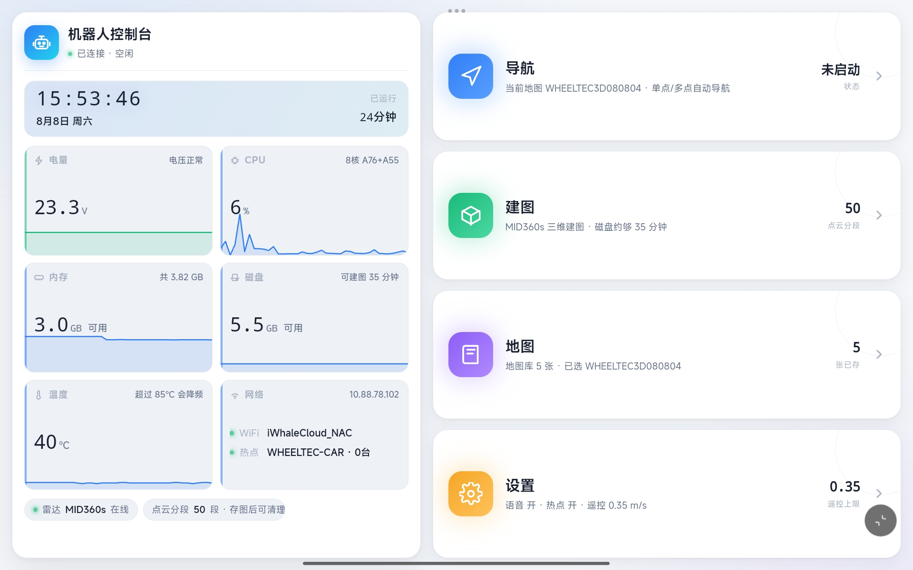
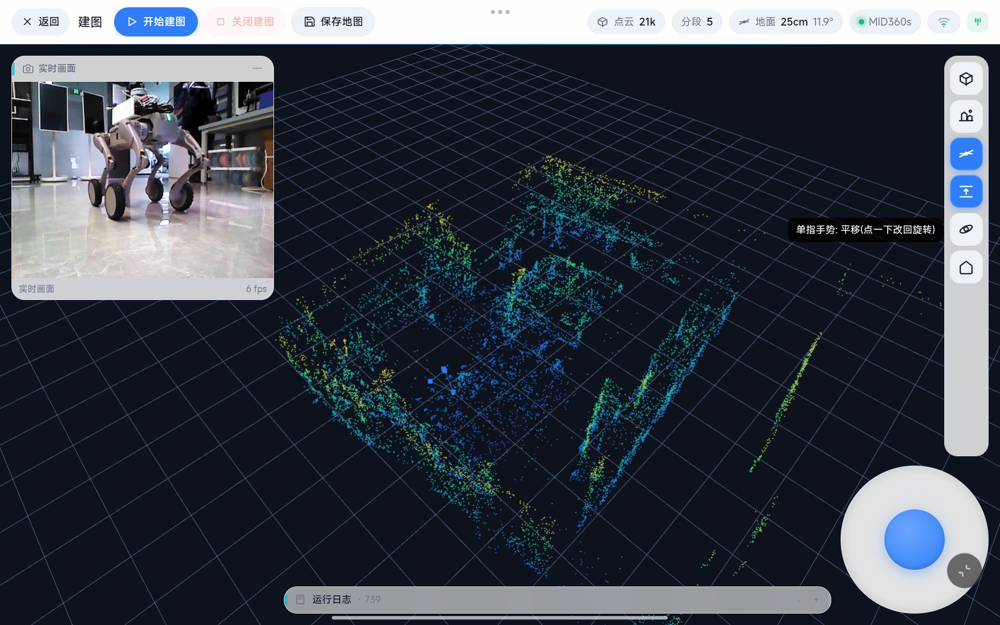
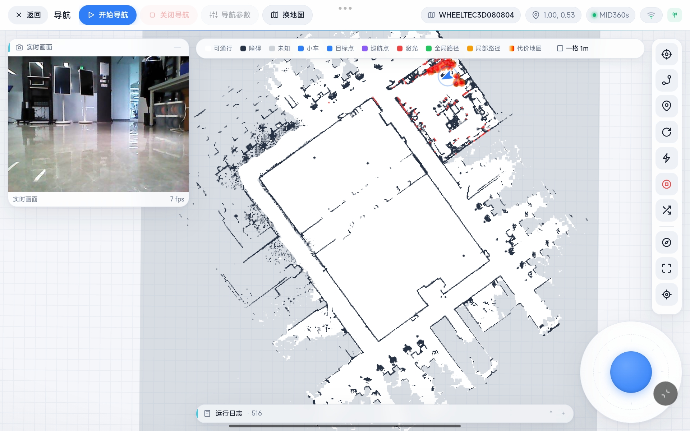
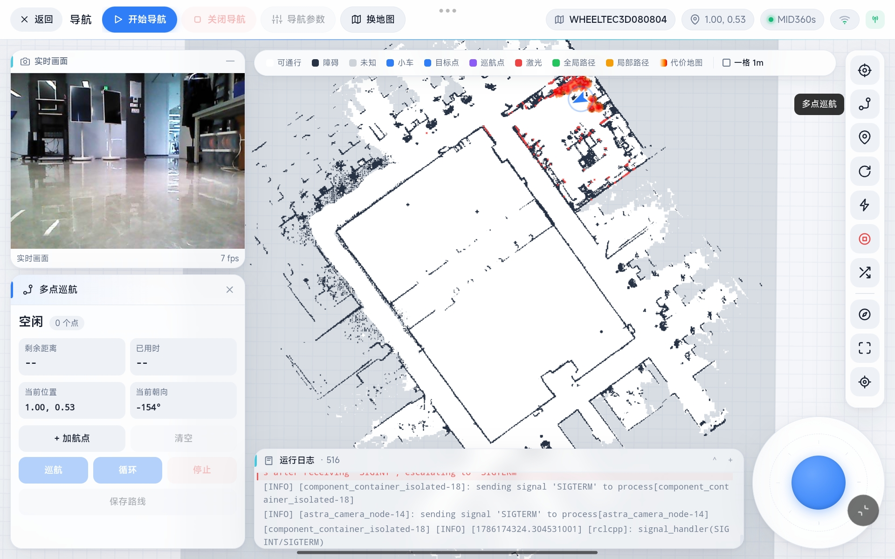
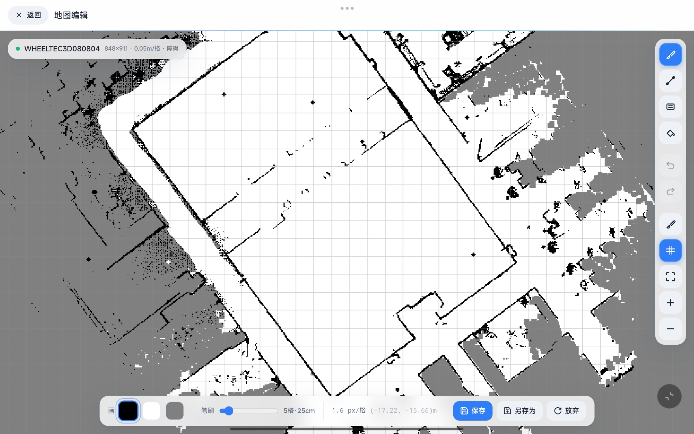
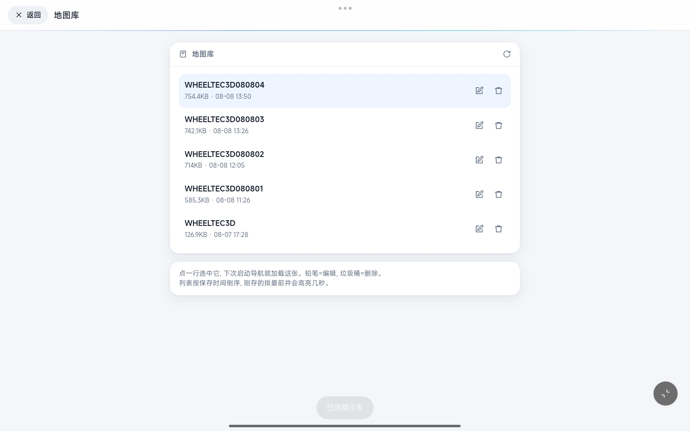
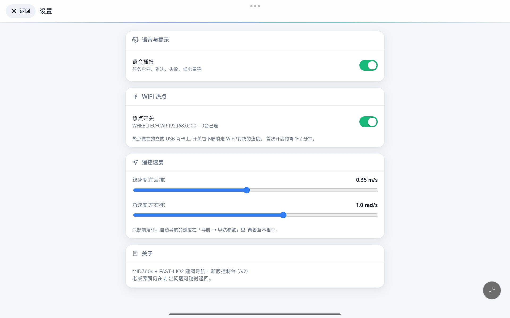
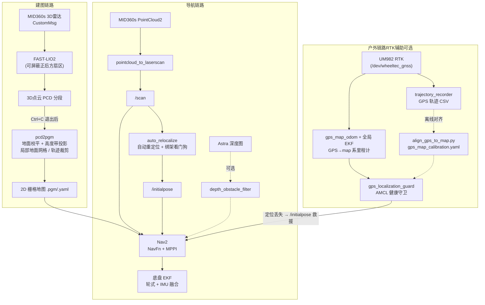
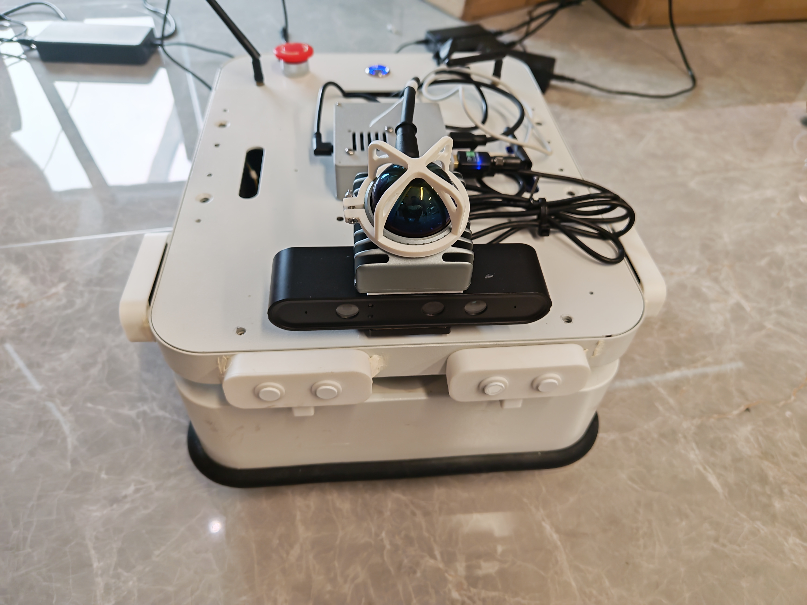

# WHEELTEC 小车 · MID360s + FAST-LIO2 建图导航 & Web 控制台

基于 **Livox MID360s 3D 激光雷达 + FAST-LIO2** 的室内建图导航方案，配套一个
**纯浏览器 Web 控制台**——手机 / 平板打开网页即可完成遥控、建图、存图、导航全流程，
小车端不需要跑 RViz。另支持 **RTK 辅助的户外建图导航**（GPS 守卫 + 优雅降级，RTK
不可用时自动回退纯激光）。

> 已在 **鲁班猫4（LubanCat4 / RK3588S，4GB 内存 / 32GB eMMC）** 无头小车主控上完整跑通，
> 从雷达驱动、建图、点云转 2D 地图、自动重定位到 Nav2 导航全链路验证通过；
> 户外 RTK 定位（UM982）已完成部署与实车验证（RTK 固定解 ±2cm）。



---

## ✨ 功能特性

| 能力 | 说明 |
|------|------|
| **3D 建图** | MID360s → FAST-LIO2 实时里程计与点云，PCD **分段落盘**（每 ~10s 一段）防内存爆掉，4GB 内存友好 |
| **点云转 2D 地图** | 自研 `pcd2pgm`：RANSAC **地面校平** + 按高度带投影 → Nav2 可用的 `.pgm/.yaml`；**局部地面网格**（坡地按格统计地面高度，不再整体误判为障碍）、**轨迹距离裁剪**（户外只保留建图轨迹附近的点，远处楼房不再把包围盒撑到 70m+）；含离群点分位裁剪、形态学闭运算补洞、地面高度可信度守卫 |
| **自动重定位 + 绑架检测** | 启动即全局扫描匹配定位，运行中看门狗持续监测；**双 σ 似然场**（宽 σ 全局搜索 / 窄 σ 健康检查）区分"蒙对"与真正定位成功。抱起小车搬到别处，~10s 内自动恢复。户外场景另叠加 **GPS 守卫**救援 |
| **户外建图导航**（新） | **RTK 辅助户外方案**：建图时记录 GPS 轨迹 → `align_gps_to_map.py` 离线对齐出 `gps_map_calibration.yaml` → 导航时 `gps_map_odom` + 全局 EKF 把 RTK 变成 map 系里程计，`gps_localization_guard` 持续监控 AMCL 健康度，定位丢失时自动下发 `/initialpose` 用 RTK 救援；RTK 不可用（没接设备 / 搜不到星 / 无对齐文件）自动降级纯激光，互不影响 |
| **Nav2 导航** | NavFn 规划 + MPPI 控制，针对差速小车做了防扭摆等参数修复 |
| **Web 控制台** | 轻量 web-rviz：实时地图 / 激光 / 全局+局部路径 / 轨迹 / 代价地图，图层可点选；摇杆遥控、点图下发目标、多点巡航、地图库与地图编辑器、语音播报、双网卡热点管理。v2 新增：**GPS 定位窗口**（卫星地图 + RTK/差分/单点/无信号状态）、**室内/户外模式一键切换**、**停靠/泊出按钮与回充点保存** |
| **3D 点云视图** | 建图页内置 WebGL 点云视图，地面平面**实时实测**（IMU 重力定法向 + 直方图定高度），不依赖会过期的标称安装角；支持"实景"模式看周围当前状况 |
| **AprilTag 自动停靠** | `tagdocking`：**外部服务触发**（`/docking_node/start_docking`，不再内置 Nav2 预导航）+ 走停式视觉伺服 + **两段式停靠**（接近 → 直行入库，入位前方位超差即报失败）+ **泊出**（`start_undock`：盲退 + 180° 调头，纯里程计闭环）；支持多种底盘 |
| **相机避障**（可选，默认关） | Astra 深度图抽样反投影成稀疏障碍点云喂给 local costmap，补雷达近场盲区 |
| **运维工具** | `clean_map.py` 用实时激光擦掉地图里"已搬走的障碍"；`blackbox.py` 每秒 fsync 落盘的黑匣子，硬断电也能追查卡死原因。启动时**DDS 共享内存残留清理改为按内核 inode 判定**（不再按进程名猜，不会误删活会话）；**建图前遗留 PCD 分段必须显式确认**（防新旧点云混成废图） |

---

## 🖼️ 界面展示

以下为 **v2 控制台**（`/v2`）实拍，平板横屏。

### 建图页 — 3D 点云视图



WebGL 实时点云（按高度着色）叠加地面网格，左上角是相机实时画面，右下角虚拟摇杆。
顶栏状态芯片里的 **`地面 25cm 11.9°`** 是**当场实测**出来的地面平面——法向取自 IMU 重力、
高度取自点云直方图最低强峰，不读 launch 里会过期的标称安装角，所以雷达支架一松就能立刻看出来。
`点云 21k` / `分段 5` 分别是当前帧点数和已落盘的 PCD 分段数。

### 导航页 — 轻量 web-rviz



地图 / 激光 / 小车 / 目标点 / 巡航点 / 全局+局部路径 / 代价地图分层显示，
顶部图例每一项都可点击开关。顶栏显示当前地图名与实时坐标。

| 多点巡航 | 地图编辑器 |
|---|---|
|  |  |
| 点图依次添加航点，支持循环巡航 | 直接在网页上擦除 / 补画障碍，三色严格对应占据/自由/未知 |

| 地图库 | 设置 |
|---|---|
|  |  |
| 多张地图管理，选中即预览 | 语音播报、热点开关、遥控速度上限 |

> v2 控制台在实拍之后还新增了：**GPS 定位窗口**（左下角，卫星地图 + RTK 固定解/差分/
> 单点/无信号状态芯片）、**室内/户外模式切换**（顶栏滑块）、建图页的**停靠/泊出按钮与
> 回充点保存**。户外界面截图尚未补拍，以实时界面为准。

> 老版界面（`/`）的截图仍保留在 `docs/images/` 下：`web-console.png`、`mapping.png`、
> `map-edit.png`、`navigation.png`、`nav-arrived.png`。

---

## 🧭 系统架构



**TF 结构**：`map --(AMCL)--> odom_combined --(EKF 轮式+IMU)--> base_footprint`。
FAST-LIO 自成一棵树（`camera_init → body`），与底盘 TF 互不干扰——建图时
RViz Fixed Frame 用 `camera_init`，导航时用 `map`。户外导航在 AMCL 之上叠加
`gps_map_odom`（把 RTK 经纬度换算成 map 系位姿）+ 全局 EKF + `gps_localization_guard`
守卫节点，GPS 只做"定位丢失救援"，不参与正常路径规划。

> ⚠️ **建图与导航不能同时运行**：两者用的雷达数据格式不同（CustomMsg vs PointCloud2），
> launch 内已内置防重复实例保护。户外与室内同理，且建图前会检查遗留 PCD 分段。

---

## 📦 包说明

本仓库**只收录本项目原创或已打补丁的包**，工作区里其余原厂 / 上游代码不随仓库分发。

| 包 | 类型 | 职责 |
|----|------|------|
| `wheeltec_fastlio` | **原创** | 核心集成包：`pcd2pgm`（点云→2D 地图，含局部地面网格 / 轨迹裁剪）、`auto_relocalize`（重定位+看门狗）、`depth_obstacle_filter`（深度图→障碍点云）、四个 launch、`clean_map.py` / `blackbox.py` 运维脚本 |
| `wheeltec_webapp` | **原创** | 浏览器 Web 控制台（后端 `app.py` + 前端 `v2.html`），含 web-rviz、3D 点云视图、地图编辑器、语音播报、热点管理、GPS 面板与室内/户外模式 |
| `wheeltec_outdoor_nav` | **原创** | RTK 辅助户外建图导航包：户外 mapping/navigation launch、`gps_map_odom`（GPS→map 里程计）、`gps_localization_guard`（AMCL 健康守卫）、`align_gps_to_map.py` / `georef_map.py`、`trajectory_recorder`、UM982 简易驱动与测试脚本，详见包内 README |
| `tagdocking` | **原创** | AprilTag 视觉自动停靠框架（外部触发 + 走停式视觉伺服 + 两段式停靠 + 泊出），详见包内 README |
| `wheeltec_n10plus` | **原创**（已归档） | N10Plus 2D 激光 + slam_toolbox 建图导航模式 |
| `wheeltec_odin1` | **原创**（已归档） | Odin1 视觉激光 SLAM 模组模式 |
| `wheeltec_robot_nav2` | 改动 | Nav2 launch / param / map，差速车参数修复 + 观测源与坐标系调整 |
| `turn_on_wheeltec_robot` | 改动 | 底盘串口 + EKF（`odom_combined → base_footprint`） |
| `FAST_LIO` | 第三方 + 补丁 | hku-mars 官方 ROS2 分支，加了 **PCD 分段保存**补丁与**正后方扇区屏蔽** |
| `livox_ros_driver2` | 第三方 + 补丁 | MID360s 驱动，加了**点云 / IMU 时间戳同步**补丁 |
| `wheeltec_lidar_ros2` | 第三方（已归档） | 镭神 lslidar 驱动（N10Plus 用） |

> **归档**指代码保留但打了 `COLCON_IGNORE` 不参与编译（本项目已定型为 MID360s 方案）。
> 想启用就删掉对应目录下的 `COLCON_IGNORE`。多传感器方案的取舍见
> [MULTI_SENSOR_GUIDE.md](MULTI_SENSOR_GUIDE.md)。

### 需要自行准备的外部依赖

| 组件 | 来源 |
|------|------|
| Nav2 本体 | `apt install ros-humble-navigation2 ros-humble-nav2-bringup` |
| Livox-SDK2 | [Livox-SDK/Livox-SDK2](https://github.com/Livox-SDK/Livox-SDK2)，需源码编译安装 |
| Astra 相机驱动（可选） | Orbbec `ros2_astra_camera`，本项目对其打过一处 TF 去重补丁，见 `CLAUDE.md` 5.5 |
| UM982 RTK 驱动 | `wheeltec_gps` 内的 `wheeltec_dual_rtk_driver`（随原厂 SDK 提供 / 自行编译），配合 `wheeltec_gnss.sh` udev 规则生成 `/dev/wheeltec_gnss` |
| 户外 Python 依赖 | `pip3 install pyproj transforms3d`；`apt install ros-humble-tf-transformations` |
| 底盘原厂包 | `wheeltec_robot_msg` / `wheeltec_robot_urdf` / `wheeltec_robot_keyboard` / `interfaces` / `depend` 等，随原厂 SDK 提供 |

---

## 🔧 硬件与实测标定



- **主控**：LubanCat4（RK3588S，4×A76 + 4×A55，4GB 内存 / 32GB eMMC）
- **3D 雷达**：Livox MID360s（以太网，主机 `192.168.1.5`，雷达 `192.168.1.1XX`）
- **底盘**：WHEELTEC 差速小车（`S100_diff`）+ IMU，6 路超声波做固件级急停
- **深度相机**（可选）：Orbbec Astra S
- **RTK 模块**（可选，户外）：和芯星通 UM982 双天线，串口 `/dev/wheeltec_gnss`（udev 规则生成），RTK 固定解精度 ±2cm
- **网络**：板载卡跑站点连 WiFi，USB 无线网卡常开热点，两块卡同时在线

**本车雷达外参**（`launch` 里的默认值，**换车必须重测**）：

| 参数 | 值 | 说明 |
|------|-----|------|
| `lidar_x` | `0.08` | 驱动轮轴心 → 雷达光心水平距离，前为正 |
| `lidar_z` | `0.28` | 雷达光心离地高度 |
| `lidar_pitch` | `0.292`（16.7°） | 下倾角，正=下倾 |
| `lidar_roll` | `0.006`（0.32°） | — |

> 雷达**故意下倾**：本项目场地地面是镜面抛光的，水平安装时掠射角下几乎收不到地面回波，
> FAST-LIO 的 z 方向缺约束会漂。倾下去之后入射角变陡，地面拟合内点率从 5.8% 涨到 28%。
> 顺带一条规律：**倾角越大，点云拟合出的外参越可信；倾角小时只能信 IMU 重力法或卷尺**。
> 支架会松、标定会过期，改过安装就要重测并**重新建图**。

---

## 🚀 构建

```bash
# 1) 系统依赖 (ROS2 Humble)
sudo apt install -y ros-humble-navigation2 ros-humble-nav2-bringup \
  ros-humble-pointcloud-to-laserscan ros-humble-robot-localization \
  ros-humble-pcl-ros ros-humble-pcl-conversions ros-humble-slam-toolbox \
  libpcl-dev libeigen3-dev

# 2) Livox-SDK2 (MID360s 必需)
git clone https://github.com/Livox-SDK/Livox-SDK2 && cd Livox-SDK2
mkdir build && cd build && cmake .. -DCMAKE_BUILD_TYPE=Release && make -j4
sudo make install && sudo ldconfig

# 3) 户外功能依赖 (可选, RTK 辅助户外建图导航用)
pip3 install pyproj transforms3d
sudo apt install -y ros-humble-tf-transformations

# 4) 编译 (4GB 内存务必限并行, 且必须先建好 swap)
cd ~/wheeltec_ros2
export MAKEFLAGS="-j3"
colcon build --packages-select livox_ros_driver2 \
  --cmake-args -DROS_EDITION=ROS2 -DDISTRO_ROS=humble
MAKEFLAGS="-j2" colcon build --packages-select fast_lio     # 模板重, 单独编
colcon build --parallel-workers 2
source install/setup.bash
```

> 💡 **4GB 内存注意**：不建 swap 编译 `fast_lio` / nav2 必 OOM；编译前确认硬件看门狗是关的
> （`systemctl show -p RuntimeWatchdogUSec` 应为 `0`），否则重度换页时机器会莫名重启。
> 详见 [CLAUDE.md](CLAUDE.md) Phase 0 与第 6 节陷阱手册。

---

## 🕹️ 使用

```bash
# ── 室内 ──
ros2 launch wheeltec_fastlio lidar_test.launch.py    # 雷达单独测试
ros2 launch wheeltec_fastlio mapping.launch.py       # 建图 (完后 Ctrl+C 才会存 PCD)
ros2 launch wheeltec_fastlio save_map.launch.py      # PCD → 2D 导航地图
ros2 launch wheeltec_fastlio navigation.launch.py    # 导航 (含自动重定位)

# ── 户外 (RTK 辅助, 可选) ──
ros2 launch wheeltec_outdoor_nav outdoor_mapping.launch.py       # 户外建图 (+记录 GPS 轨迹)
ros2 launch wheeltec_outdoor_nav outdoor_mapping.launch.py enable_gps:=false   # 无 RTK, 纯激光建图
ros2 run wheeltec_outdoor_nav align_gps_to_map.py                # 离线对齐 GPS-地图 (出 gps_map_calibration.yaml)
ros2 launch wheeltec_outdoor_nav outdoor_navigation.launch.py \
    map:=~/wheeltec_ros2/outdoor_maps/OUTDOOR_MAP.yaml           # 户外导航 (带 GPS 守卫)
ros2 launch wheeltec_outdoor_nav outdoor_navigation.launch.py \
    enable_gps_guard:=false                                      # 纯 AMCL 户外导航
```

常用参数覆盖：

```bash
# 建图时不屏蔽正后方扇区 (默认屏蔽 90°, 避免跟车的人被建进地图)
ros2 launch wheeltec_fastlio mapping.launch.py blind_back_deg:=0

# 建图前有上次遗留的 PCD 分段会拒绝启动 (防新旧点云混成废图);
# 旧数据确认不要了再清:
ros2 launch wheeltec_fastlio mapping.launch.py clear_pcd:=true

# 纯雷达导航 (相机故障时用; 相机默认只出画面, 不参与避障)
ros2 launch wheeltec_fastlio navigation.launch.py use_camera:=false

# 启用相机避障 (还需同步改 param 的 observation_sources)
ros2 launch wheeltec_fastlio navigation.launch.py camera_avoid:=true

ros2 service call /relocalize std_srvs/srv/Trigger    # 手动触发重定位

# ── AprilTag 停靠 / 泊出 (先把机器人送入 Tag 视野, 再触发视觉停靠) ──
ros2 service call /docking_node/start_docking std_srvs/srv/Trigger   # 视觉停靠 (走停式伺服 + 两段式入库)
ros2 service call /docking_node/start_undock  std_srvs/srv/Trigger   # 泊出 (盲退 + 180° 调头, 纯里程计)
```

运维脚本：

```bash
# 地图里有"已经搬走却擦不掉"的障碍导致规划失败时, 开着车过一遍那些区域
ros2 run wheeltec_fastlio clean_map.py --duration 180 --write

# 黑匣子: 装成开机自启服务 / 查看上次断电前 30 秒发生了什么
ros2 run wheeltec_fastlio blackbox.py --install
ros2 run wheeltec_fastlio blackbox.py --report
```

### Web 控制台

由 systemd 托管（`wheeltec-webapp.service`，开机自启），浏览器访问：

- `http://<小车IP>:8080/v2` — **当前在用的界面**（建图 3D 点云视图、地图编辑器、GPS 面板、室内/户外切换、停靠/泊出等）
- `http://<小车IP>:8080/` — 旧版界面，保留

改完 `wheeltec_webapp` 的代码要 `colcon build --packages-select wheeltec_webapp`
再 `sudo systemctl restart wheeltec-webapp`（服务跑的是 `install/` 里的副本）。
**建图期间不要重启该服务**——建图进程是 webapp 的子进程，会被一起杀掉且不会存 PCD。

---

## ⚙️ 首次使用必改

1. **雷达 IP**：每台 MID360s 出厂 IP 为 `192.168.1.1XX`（XX = SN 后两位）。
   探测：`for i in $(seq 100 199); do ping -c1 -W0.3 192.168.1.$i &>/dev/null && echo 192.168.1.$i; done`
   改到 `wheeltec_fastlio/config/MID360s_config.json` 后重新编译该包。
2. **WiFi 热点密码**：`wheeltec_webapp/wifi_ap_setup.sh` 里的 `PASSWORD="CHANGE_ME"` 换成自己的。
3. **本车标定**：雷达外参 `lidar_x/z/pitch/roll`（`mapping` 与 `navigation` 两个 launch **必须一致**）、
   车体 `footprint`（`param_<car_mode>.yaml` 的 local/global costmap 两处）。
4. **硬编码路径**：若用户名不是 `wheeltec`，检查 launch 与 `pcd2pgm` 里的绝对路径。
5. **GPS 设备（户外才需要）**：插上 UM982 后先跑 `wheeltec_gps` 里的 `wheeltec_gnss.sh`
   生成 `/dev/wheeltec_gnss`；`outdoor_navigation` 的 `gps_port` / `calibration_file` 按实际调整。
   缺对齐文件时 GPS 守卫自动禁用，不影响纯激光使用。

---

## 📚 文档

| 文档 | 内容 |
|------|------|
| [CLAUDE.md](CLAUDE.md) | **主文档**：完整移植指南、关键补丁清单、全部实测踩坑记录（按症状索引的陷阱手册） |
| [MULTI_SENSOR_GUIDE.md](MULTI_SENSOR_GUIDE.md) | MID360s / N10Plus / Odin1 三种传感器方案的对比与切换 |
| [wheeltec_outdoor_nav/README.md](wheeltec_outdoor_nav/README.md) | 户外 RTK 建图 / 对齐 / 导航全流程与参数 |
| [GPS_WEBAPP_V2_COMPLETE.md](wheeltec_webapp/GPS_WEBAPP_V2_COMPLETE.md) | Web 控制台 GPS 面板接入说明 |
| `wheeltec_fastlio/README.md` | 核心集成包的节点、参数与 launch 详解 |
| `wheeltec_fastlio/CLAUDE_*_PORT.md` | 移植到鲁班猫4 / NUC 的分平台记录 |
| `tagdocking/README.md` | AprilTag 停靠系统的状态机、底盘适配与调参 |

### 几个反复踩到的坑（详见 CLAUDE.md 第 6 节）

- **镜面/抛光地面**会把激光整片反射走，导致地图大片"未知"、地面拟合不可信——
  `pcd2pgm` 为此加了闭运算补洞和地面高度守卫，换到地毯 / 哑光地面要把这些参数调回去。
- **nav2 的 `static_layer` 清不掉建图时录进去的障碍**，搬走家具后会在全局图上留幻影，
  表现为"那块明明是空的却规划失败"，`clear_entirely_global_costmap` 对此无效 → 用 `clean_map.py`。
- **humble 版 MPPI 改 `vx_max`/`wz_max` 不生效**（写进了错误的结构体且永远返回成功），
  需补发一条 `/speed_limit` 才会同步。
- **被强杀的 ROS 进程会在 `/dev/shm` 留下已锁定的信号量**，导致下次 nav2 容器 100% CPU 且零日志
  （launch 已内置按内核 inode 判定的自动清理）。
- **最后一个 SSH 会话关掉 ~10 秒后导航进程间数据全断**（发现正常但收不到数据、EKF 发散）：
  systemd-logind 默认 `RemoveIPC=yes` 会清掉非登录会话（systemd 服务）的 `/dev/shm`。
  本机已加 `/etc/systemd/logind.conf.d/10-keep-ros-shm.conf`（`RemoveIPC=no`）修复；
  **重装系统后要重新加**。查证：`busctl get-property ... Manager RemoveIPC` 应为 `b false`。
- **建图前不清旧 PCD 分段，save_map 会把两次建图的点云混成废图**：launch 检测到遗留
  分段会拒绝启动，需显式 `clear_pcd:=true`（或先备份），网页控制台点"建图"会弹窗确认。

---

## 📄 许可 / 致谢

- 原创部分（`wheeltec_fastlio` / `wheeltec_webapp` / `wheeltec_outdoor_nav` / `tagdocking` /
  `wheeltec_n10plus` / `wheeltec_odin1`）版权归本仓库作者。
- 第三方组件版权归各自作者并保留其原始 LICENSE：
  [FAST-LIO](https://github.com/hku-mars/FAST_LIO)、
  [livox_ros_driver2](https://github.com/Livox-SDK/livox_ros_driver2)、
  [Nav2](https://github.com/ros-navigation/navigation2)、
  [Orbbec Astra 驱动](https://github.com/orbbec/ros2_astra_camera)、
  镭神 lslidar 驱动、WHEELTEC 原厂底盘包、和芯星通 UM982 RTK 模组。
